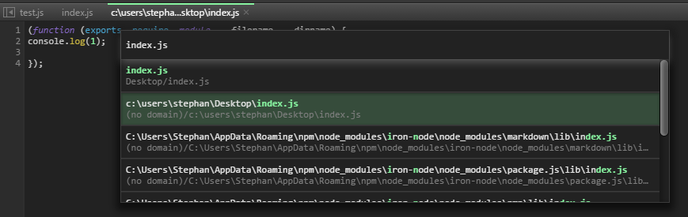
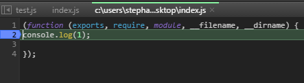

# Master the break-points
There are 2 ways to declare a break point.

### The keyword debugger
### The break-point in DevTools GUI (```ctrl+b``` or ```right / left click``` on the line number in source code side bar).
This one needs some attention. To set up a break point from within GUI the desired JavaScript needs to be loaded into memory first, so that it is available for selection. :warning: Heads up : After that there are 2 Versions available via ```ctrl+p```
The first one (mapped via ```autoAddWorkSpace```) is ready to edit and save from within DevTools.
  

The second one (loaded into memory) is awaiting custom [conditional] breakpoints and is always surrounded by the Node.js module scope (function (exports, require, module, __filename, __dirname) {});.
  

## If you are not planing to use the editing features of DevTools...
There is a way to disable the mapping via [Local and global configuration](CONFIGURATION.md)