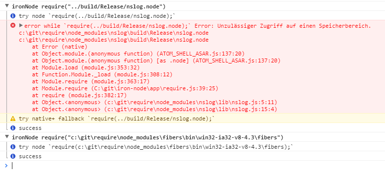

# Native Node module compatibility

> The native Node modules are supported by Electron, but since Electron is using a different V8 version from official Node, you have to manually specify the location of Electron's headers when building native modules.  
See https://github.com/atom/electron/blob/master/docs/tutorial/using-native-node-modules.md for more details.

*ironNode uses [electron-recompile](https://github.com/s-a/electron-recompile) which aims to help to compile native modules for a specific electron version.* Normaly it depends on the Node.js module if you can manage different native versions at the same time.


## To make a long story short

### --compile (Compile all native modules in Node.js project)
I implemented both [```electron-recompile```](https://github.com/s-a/electron-recompile) and [```Node Module Path```](https://github.com/s-a/nmp) to implement a "re-compile" feature.  
By ```calling iron-node --compile[=your-node-project-path]``` you can recompile all native modules in the ```node_modules``` subfolder or the current workking directory against the current installed iron-node v8 version.  

### Extend require to search native modules respecting the current v8 version.
If you ever get an error while loading native node modules you can activate an overwrite of the internal node [```require```](/../app/require.js) function. You can make use of ```native+``` option after you have re-compiled all native modules in your node project folder with ```iron-node --compile=<path>```.  *So far this option needs manual activation. May be it defaults to ```true``` in future. Once we have figured out that it is not dangerous :flushed:*.  


See [Local and global configuration](CONFIGURATION.md) to learn how to configure the [.iron-node.js](/.iron-node.js) configuration file.


  

## Dependencies
- Install node.js
- Install Python 2.7
- A c++ compiler. On Windows
 - Option 1 :  Install [Visual C++ Build Tools](http://go.microsoft.com/fwlink/?LinkId=691126) on production servers using the default Install option.
 - Option 2 :  [Microsoft Visual C++ 2015 Express](https://www.visualstudio.com/products/visual-studio-community-vs) works best but only needed for development.
 - Troubleshooting: A detailed description can be found at https://github.com/Microsoft/nodejs-guidelines/blob/master/windows-environment.md#environment-setup-and-configuration
- Envronment variables
 - ```npm config set msvs_version 2015 --global``` 
 - ```set GYP_MSVS_VERSION 2015``` (Optional)