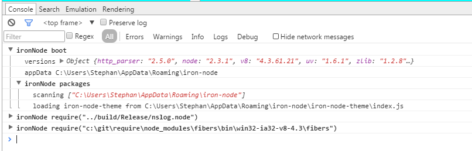

# ironNode packages
ironNode use [package.js](https://github.com/s-a/package.js) to open the software to plugin developers. 
If exists it scans the AppData directory for installed plugins.  

A list of plugins is available here: https://www.npmjs.com/browse/keyword/iron-node.

To install a Plugin: 

```bash
# on Windows
cd %APPDATA%

# on Linux
cd $XDG_CONFIG_HOME
# or
cd ~/.config;

# on OS X
cd ~/Library/Application Support;

# create if not exists
mkdir iron-node;

# Finaly
cd iron-node;
npm install your-plugin;
```

## For package developers.
A ironNode package is identified by ```iron_node_package : true``` within package.json.  

If you need any events feel free to submit a PR or create an issue.

## Example package

### package.json
```javascript
{
  "name": "iron-node-theme",
  "version": "1.0.0",
  "description": "",
  "main": "index.js",
  "iron_node_package": true,
  "scripts": {
    "test": "echo \"Error: no test specified\" && exit 1"
  },
  "author": "Stephan Ahlf <stephan.ahlf@gmail.com> (https://github.com/s-a)",
  "license": "ISC"
}
```


### index.js
```javascript
var MyPlugin = function() {
	this.init();
	return this;
};


MyPlugin.prototype.init = function() {
	var path = require("path");

	// CSS injection
	var style = document.createElement("style");
	style.setAttribute('type', 'text/css');
	style.innerHTML = "body{background-color:yellow}";
	window.document.head.appendChild(style);

	// external CSS file
	var style2 = document.createElement("link");
	style2.setAttribute('rel', 'stylesheet');
	style2.setAttribute('type', 'text/css');
	style2.setAttribute('href', 'file://' + path.join(__dirname, "custom.css"));
	window.document.head.appendChild(style2);
};

module.exports = MyPlugin;
```

### custom.css
```css
/*custom.css*/
body{
    color:cyan;
}
```


